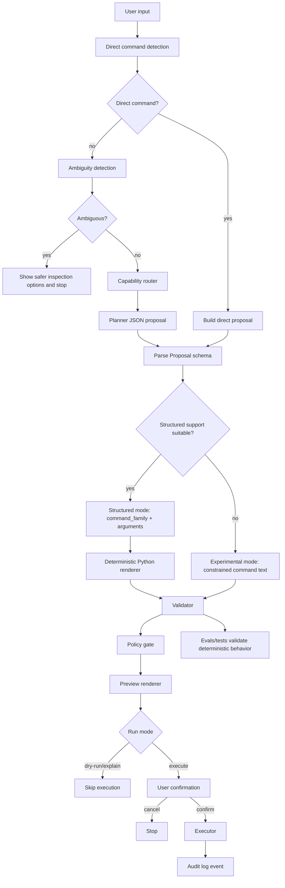

# Request Lifecycle

This is the central execution flow for OTerminus.

## Stage details

### 1) User input

Input can be:

- natural language (`"find large files here"`)
- direct command (`"ls -lah"`)

### 2) Direct command detection

If input already looks like a supported command family invocation, OTerminus skips LLM planning and builds a direct proposal. Direct proposals still continue through proposal parsing, validation, policy checks, preview, and confirmation.

### 3) Ambiguity handling

For natural language, broad/destructive underspecified wording is blocked early and replaced with safer read-only inspection options.

### 4) Capability router

A deterministic router classifies the request into categories like `filesystem_inspect`, `filesystem_mutate`, `text_search`, `process_inspect`, etc.

### 5) Planner + parsing

Planner asks Ollama for JSON output and validates it against the `Proposal` schema. The schema supports only two first-class modes: `structured` and `experimental`.

Planner and parser prefer structured mode when command family + arguments can be represented deterministically. Experimental mode is used only when structured support is unavailable or unsuitable for a constrained single-command proposal.

### 6) Structured or experimental proposal handling

For structured proposals, Python renders final command strings/argv from typed arguments instead of trusting command text. Experimental proposals may carry command text, but they remain constrained by parsing, registry, validator, policy, preview, and stronger confirmation.

### 7) Validation and policy

Validator enforces:

- curated command-family allowlist
- operand/flag shape checks
- blocked operators/redirection/chaining
- path safety checks (including allowed roots)
- risk + policy mode compatibility

### 8) Preview and confirmation

OTerminus renders preview details (command, mode, risk, warnings/rejections).

Execution requires explicit confirmation. Experimental mode uses very-strong confirmation text. Failed validation or policy checks stop before execution.

### 9) Execution

Executor runs command argv via subprocess, with special local handling for `cd` and `clear`.

### 10) Audit logging

When enabled, OTerminus writes a JSONL event with request lifecycle fields (routing, mode, validation, confirmation, exit code, duration).

### 11) Evals and tests

Deterministic fixture evals and unit tests assert lifecycle invariants and prevent regressions.
