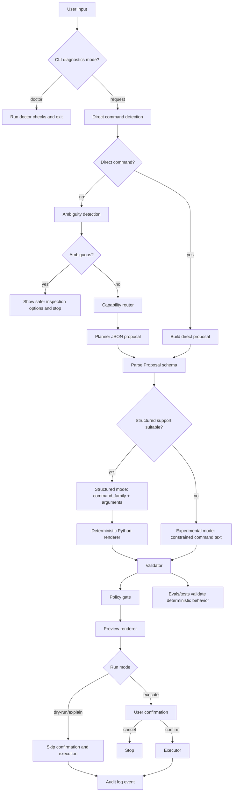

# Request Lifecycle

This is the central execution flow for OTerminus.

## Stage details

### 1) User input

Input can be:

- the explicit diagnostics command (`doctor`), which runs readiness checks and exits outside the
  normal request planning/execution lifecycle
- natural language (`"find large files here"`)
- direct command (`"ls -lah"`)

### 2) Direct command detection

If input already looks like a supported command family invocation, OTerminus skips LLM planning and
builds a direct proposal. Direct proposals still continue through proposal parsing, validation,
policy checks, preview, and confirmation in execute mode. In `--dry-run` or `--explain` one-shot
mode, direct proposals do not require Ollama if direct detection succeeds.

### 3) Ambiguity handling

For natural language only, broad/destructive underspecified wording is blocked early and replaced
with safer read-only inspection options. Direct shell commands are detected first, so requests such
as `rm -rf build` or `chmod +x run.sh` continue into the validator/policy path instead of being
handled by natural-language ambiguity heuristics.

Ambiguous requests stop before planner setup, planner calls, validation, confirmation prompts, and
execution. Their audit events use `confirmation_result: "blocked_ambiguous"` and include the
ambiguity reason plus suggested safe options.

### 4) Capability router

A deterministic router classifies the request into categories like `filesystem_inspect`,
`filesystem_mutate`, `text_search`, `process_inspect`, etc.

### 5) Planner + parsing

Planner asks Ollama for JSON output and validates it against the `Proposal` schema. The schema
supports only two first-class modes: `structured` and `experimental`.

Planner and parser prefer structured mode when command family + arguments can be represented
deterministically. Experimental mode is used only when structured support is unavailable or
unsuitable for a constrained single-command proposal.

### 6) Structured or experimental proposal handling

For structured proposals, Python renders final command strings/argv from typed arguments instead of
trusting command text. Experimental proposals may carry command text, but they remain constrained by
parsing, registry, validator, policy, preview, and stronger confirmation.

### 7) Validation and policy

Validator enforces:

- curated command-family allowlist
- operand/flag shape checks
- blocked operators/redirection/chaining
- path safety checks (including allowed roots)
- risk + policy mode compatibility

### 8) Preview and run mode

OTerminus renders preview details (command, mode, risk, warnings/rejections).

The normal execute mode requires explicit confirmation after a successful preview. Experimental mode
uses very-strong confirmation text. Failed validation or policy checks stop before execution.

One-shot `--dry-run` and `--explain` modes still use direct detection or planning, validation,
policy checks, and preview rendering, but intentionally skip confirmation and execution. The REPL
`dry-run <request>` and `explain <request>` built-ins provide the same inspection behavior inside an
interactive session.

### 9) Execution

Executor runs command argv via subprocess, with special local handling for `cd` and `clear`.

### 10) Audit logging

When enabled, OTerminus writes a JSONL event with request lifecycle fields (routing, mode,
validation, confirmation, exit code, duration). Ambiguous requests record the ambiguity outcome and
`blocked_ambiguous` status without planner, validation, confirmation, or execution fields. Dry-run
and explain requests record skipped execution status instead of an execution exit code.

### 11) Evals and tests

Deterministic fixture evals and unit tests assert lifecycle invariants and prevent regressions.
