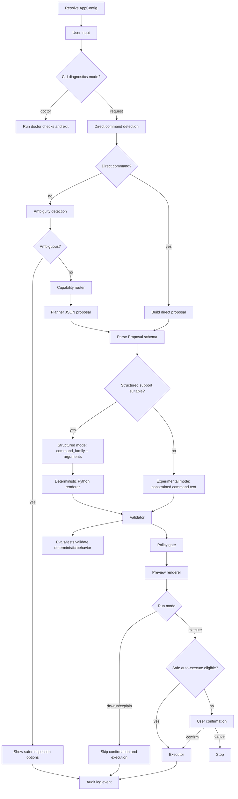

# Request Lifecycle

This is the central execution flow for OTerminus. The order is deliberate: OTerminus detects direct
shell commands before applying natural-language ambiguity heuristics. Only non-direct,
natural-language requests are checked for ambiguity before capability routing and planner calls.

Before request handling begins, OTerminus resolves runtime configuration into `AppConfig`.
Resolution applies exported environment variables, current-directory `.env`, validated user config,
and built-in defaults in that order for supported settings. The persistent user config is a
schema-versioned JSON preference file; invalid JSON, unknown fields, unsupported schema versions, or
invalid security-relevant values fail startup with a bounded configuration error instead of being
silently ignored. `OTERMINUS_CONFIG_PATH` and `OTERMINUS_ALLOW_DANGEROUS` remain environment/.env
only.

## Stage details

### 1) User input

Input can be:

- the explicit diagnostics command (`doctor`), which runs readiness checks and exits outside the
  normal request planning/execution lifecycle
- natural language (`"find large files here"`)
- direct command (`"ls -lah"`)

### 2) Direct command detection

Direct command detection runs before ambiguity detection. If input already looks like a supported
command family invocation, OTerminus skips LLM planning and builds a direct proposal. Examples such
as `chmod +x run.sh` and `rm -rf build` are not intercepted as ambiguous natural language.

Direct proposals still continue through proposal parsing, structured rendering when available,
validation, policy checks, preview, and confirmation policy in execute mode. In `--dry-run` or
`--explain` one-shot mode, direct proposals do not require Ollama if direct detection succeeds.

### 3) Ambiguity handling

Ambiguity detection runs only for non-direct natural-language requests. It looks for broad,
destructive, or underspecified wording such as “clean this folder”, “delete unnecessary files”, or
“repair permissions”. When such a request is ambiguous, OTerminus shows a short explanation and safe
read-only inspection alternatives.

Ambiguous requests stop before planner setup, planner calls, validation, confirmation prompts, and
execution. Nothing is executed, including in dry-run or explain mode. Their audit events use
`confirmation_result: "blocked_ambiguous"` and include the ambiguity reason plus suggested safe
options. They also record planner skip diagnostics with `planner_invoked: false`,
`planner_skipped: true`, and `planner_skip_reason: "ambiguity_blocked"`.

### 4) Capability router

A deterministic router classifies the request into categories like `filesystem_inspect`,
`filesystem_mutate`, `text_search`, `process_inspect`, etc.

### 5) Planner + parsing

Planner asks Ollama for JSON output and validates it against the `Proposal` schema. The schema
supports only two first-class modes: `structured` and `experimental`.

Planner and parser prefer structured mode when command family + arguments can be represented
deterministically. Experimental mode is used only when structured support is unavailable or
unsuitable for a constrained single-command proposal.

### 6) Structured or experimental proposal handling

For structured proposals, Python renders final command strings/argv from typed arguments instead of
trusting command text. Direct commands may also be normalized into structured arguments when a parser
is available. Experimental proposals may carry command text, but they remain constrained by parsing,
registry, validator, policy, preview, and stronger confirmation.

Normal experimental previews use plain user-facing wording:
`Experimental command: this was not rendered from typed structured arguments. Review it carefully before running.`
Verbose previews may add the architecture diagnostic:
`Experimental mode stays outside deterministic structured rendering and uses stricter confirmation.`

Some trusted direct commands may remain experimental when the typed schema cannot represent the
user's argv exactly. For example, `ls -ltrh` is detected locally, skips Ollama planning, preserves
`["ls", "-ltrh"]`, and reaches validation with direct-command origin. Natural-language requests such
as "show files sorted by modification time" still go through the local planner or Ollama planner and
can only produce typed structured arguments.

### 7) Validation and policy

Validator enforces:

- curated command-family allowlist
- operand/flag shape checks
- blocked operators/redirection/chaining
- path safety checks (including allowed roots)
- risk + policy mode compatibility

### 8) Preview and run mode

OTerminus renders preview details (command, mode, risk, warnings/rejections).

The normal execute mode requires explicit confirmation after a successful preview by default.
Experimental mode uses very-strong confirmation text and requires the exact phrase
`EXECUTE EXPERIMENTAL`. Failed validation or policy checks stop before execution.

If `OTERMINUS_AUTO_EXECUTE_SAFE=true`, OTerminus evaluates a narrow local policy after preview and
after dry-run/explain have already returned. The confirmation prompt may be skipped only for
validated, warning-free, structured, exact-`safe` commands from direct detection or the deterministic
local planner. Ollama-planned proposals, experimental proposals, network-touching commands, write or
dangerous commands, project-health commands, archive extraction/creation, commands with warnings,
history reruns, dry-run, and explain mode never qualify. The executor still runs only after the
preview has been printed.

One-shot `--dry-run` and `--explain` modes still use direct detection and, for specific
natural-language requests, planning, validation, policy checks, and preview rendering. Ambiguous
natural-language requests stop earlier in every run mode. Dry-run and explain intentionally skip
confirmation and execution after successful validation. The REPL `dry-run <request>` and
`explain <request>` built-ins provide the same inspection behavior inside an interactive session.

### 9) Execution

Executor runs command argv via subprocess, with special local handling for `cd` and `clear`.

### 10) Audit logging

When enabled, OTerminus writes a JSONL event with request lifecycle fields (routing, mode,
validation, confirmation result or safe auto-execute skip, exit code, duration). Ambiguous requests record the ambiguity outcome and
`blocked_ambiguous` status without planner, validation, confirmation, or execution fields. Dry-run
and explain requests record skipped execution status instead of an execution exit code.

### 11) Evals and tests

Deterministic fixture evals and unit tests assert lifecycle invariants and prevent regressions.

## REPL history-aware commands in lifecycle terms

In REPL mode, `history`, `history <n>`, and `explain <history_id>` are local inspection commands
for the current process session and do not execute shell commands.

`rerun <history_id>` does not shortcut execution. It submits the original user input back into the
same request lifecycle described above, including ambiguity handling, planning/direct detection,
validation/policy, preview, and explicit execute confirmation. Reruns are never eligible for safe
auto-execute, even when the original request would otherwise qualify.

- After routing, OTerminus attempts a deterministic local planner for a small set of unambiguous requests. If it matches, Ollama is skipped and the same validation/preview/confirmation policy flow continues.

### Timing observability

When audit logging is enabled, lifecycle stages record approximate local latencies in `timings_ms` using `time.perf_counter()` (milliseconds). These metrics are for debugging and contributor observability; they do not include command stdout/stderr content.
